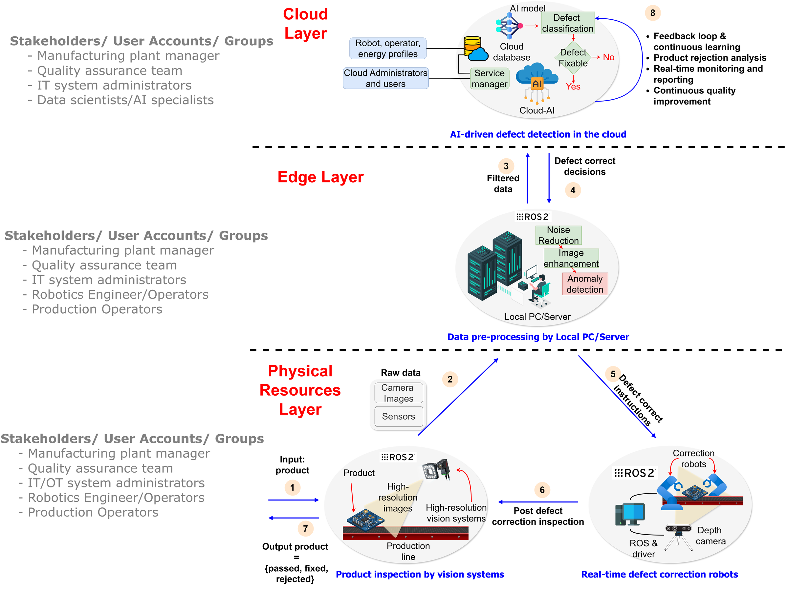
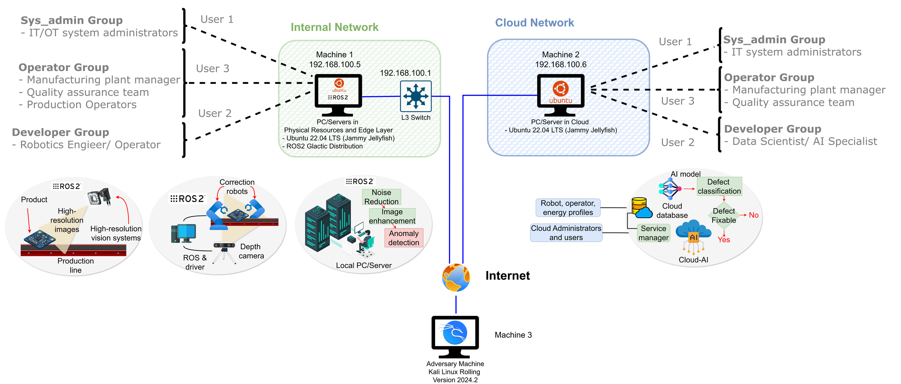
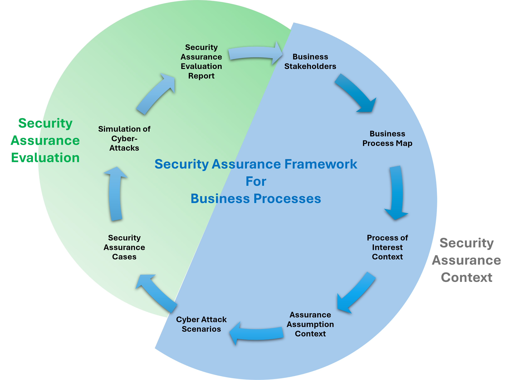

# Cloud-Robotics Red Team Assessment

**Dell Technologies–Funded Security Research | Munster Technological University | 2024–2025**

> *Measuring Security Assurance Confidence in Business Processes: A Novel Framework with Cloud-Robotics Case Study*
> A. B. Masood, V. Cionca, D. O'Shea — MTU Cork (paper in submission, IEEE Access)

---

## Overview

This repository documents a full red team security assessment of a **cloud-robotic automated quality control process** in a simulated Industry 4.0 smart manufacturing environment. The engagement was conducted as part of a Dell Technologies–funded security assurance research project at Munster Technological University.

Two complete attack chains were designed, executed, and measured against a live simulated environment. Every step is mapped to MITRE ATT&CK TTPs, scored with CVSS/RVSS, and evaluated using a novel quantitative security assurance framework developed as part of this research.

---

## Target Environment

The target is a three-layer cloud-robotics business process for automated quality control:



| Layer | Components | Role |
|-------|-----------|------|
| **Physical** | PincherX-150 robotic arms, vision systems, production line | Product inspection and defect correction |
| **Edge** | Ubuntu 22.04 LTS VMs, ROS2 Galactic, Local PC/Server | Data preprocessing, robotic control |
| **Cloud** | Ubuntu 22.04 LTS VM, CNN-based AI defect detection model | AI inference, defect classification, decision dispatch |

**Attacker position:** Kali Linux machine, zero prior knowledge of internal systems, no insider access.

**Simulation:** Two VirtualBox VMs on an isolated network — Machine 1 (internal/edge, `192.168.100.5`) and Machine 2 (cloud, `192.168.100.6`).



---

## Attack Scenarios

### Scenario 1 — ROS2 Command Injection via SROS2 Bypass

Exploitation of two zero-day-class vulnerabilities in SROS2 access control to inject malicious commands into the defect correction robotic arm, causing trajectory manipulation and denial-of-service.

**Attack chain:** Spearphishing → SSH foothold → Python sudo privilege escalation → SROS2 permission file replacement → unauthorised ROS2 topic publish → robotic arm trajectory manipulation

**Security assurance score:** 4.66/10 (Moderate Security — vulnerabilities outweigh controls)

→ [Full Scenario 1 writeup](attack-scenarios/scenario-1-ros2-command-injection/README.md)

---

### Scenario 2 — CVE-2023-38408 Lateral Movement + AI Model Poisoning

Exploitation of a critical (CVSS 9.8) OpenSSH agent forwarding vulnerability to move from the edge layer to the cloud layer, followed by adversarial data poisoning of a deployed CNN defect detection model using FGSM.

**Attack chain:** Spearphishing → SSH foothold → Python sudo escalation → CVE-2023-38408 SSH agent hijacking → lateral movement to cloud VM → FGSM adversarial inference poisoning → AI model misclassification (+111% increase in errors)

**Security assurance score:** 4.79/10 (Moderate Security)

→ [Full Scenario 2 writeup](attack-scenarios/scenario-2-cve-2023-38408/README.md)

---

## Repository Structure

```
cloud-robotics-redteam/
├── assets/                            # Figures from Overleaf paper source
├── framework/
│   └── security-assurance-framework.md    # The novel SAE framework methodology
├── environment/
│   ├── architecture.md                    # Three-layer target architecture
│   └── simulation-setup.md               # VirtualBox network configuration
├── attack-scenarios/
│   ├── scenario-1-ros2-command-injection/
│   │   ├── README.md                      # Full attack walkthrough
│   │   ├── mitre-attack-mapping.md        # Complete TTP mapping
│   │   ├── vulnerabilities.md             # SROS2 vulnerability analysis
│   │   └── security-metrics.md            # Quantitative assurance results
│   └── scenario-2-cve-2023-38408/
│       ├── README.md                      # Full attack walkthrough
│       ├── cve-2023-38408-analysis.md     # Deep CVE analysis and PoC context
│       ├── mitre-attack-mapping.md        # Complete TTP mapping
│       └── security-metrics.md            # Quantitative assurance results
├── code/
│   ├── ai-model/                          # CNN model, training, FGSM attack
│   └── ros2-attack/                       # Adversarial ROS2 node, motion control
└── mitigations/
    └── recommendations.md                 # Hardening and remediation guidance
```

---

## Security Assurance Framework



A novel framework was developed for this engagement combining:
- Business process mapping and Process of Interest (PoI) definition
- Stakeholder-driven assurance assumption context
- MITRE ATT&CK–based threat modelling
- **Quantitative security assurance metrics** (AM = RM − VM) using CVSS/RVSS scoring

The framework fills a gap in existing SAE methodologies that focus on system-level security rather than end-to-end business process security. Full framework documentation: [framework/security-assurance-framework.md](framework/security-assurance-framework.md)

---

## Key Findings

| Finding | Severity | Impact |
|---------|----------|--------|
| SROS2 Permission File Replacement | High (CVSS 8.5) | Persistent unauthorised ROS2 pub/sub access after permission revocation |
| SROS2 Outdated Node Service | High (CVSS 8.0) | Prevents security policy enforcement without node restart |
| CVE-2023-38408 SSH Agent Forwarding RCE | Critical (CVSS 9.8) | Lateral movement from edge to cloud VM with full RCE |
| Python sudo misconfiguration | High | Direct privilege escalation to root |
| Adversarial AI inference poisoning (FGSM) | High | 111% increase in defect misclassification, product quality degradation |

---

## Tools Used

`Kali Linux` · `Nmap` · `Metasploit` · `GTFOBins` · `ROS2 / SROS2` · `Python` · `PyTorch` · `VirtualBox`

---

## Context

This work is part of a broader research programme on security assurance for Industry 4.0 systems at MTU Cork. Related research outputs:

- **Paper (in submission):** "Measuring Security Assurance Confidence in Business Processes: A Novel Framework with Cloud-Robotics Case Study" — A. B. Masood, V. Cionca, D. O'Shea, IEEE Access 2025
- **Related repo:** [dd-ids-iot](https://github.com/abdullahbm09/dd-ids-iot) — Data-driven IDS for IIoT using PCA with Hotelling T² and SPE statistics

---

*MTU Cork · Dell Technologies–Funded Research · 2024–2025*
